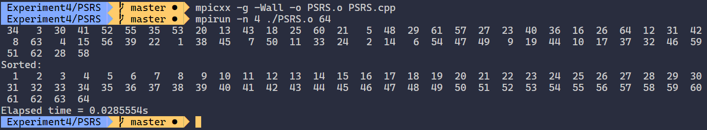

# <center>实验 4</center>

##### <p align="right">PB17000297 罗晏宸</br>2020.8.7</p>

### 实验题目

使用MPI，实现**PSRS**(Parallel sorting by regular sampling)算法，

### 实验环境

#### 操作系统

Windows Subsystem for Linux: Ubuntu 18.04 LTS （内核版本 4.4.0-18362-Microsoft）

#### 编译环境

- g++ 7.5.0

- OpenMP 4.5.0

- MPICH 3.3a2

#### 硬件配置

​	Intel&reg;  Core&trade;  i5-7200U CPU

- 内核数：2
- 线程数：4（超线程）

### 算法设计与分析

如[Wake Forest University的相关网页](http://csweb.cs.wfu.edu/bigiron/LittleFE-PSRS/build/html/PSRSalgorithm.html)所述，算法有如下的几个核心步骤

#### 阶段 I ：初始化

启动 $p$ 个进程，并让 `root` 进程 `0` 获得大小为 $n$ 的数据。

#### 阶段 II ：散播数据、本地排序与均匀采样

将数据散播到 $p$ 个进程中。每个进程对本地的子数据（大约 $\dfrac{n}{p}$ 个）进行快速排序。每个进程从本地排好序的子数据中等距选取 $p$ 个样本点。

#### 阶段 III ：收集合并样本、选择 $p - 1$ 个划分元素并广播

`root` 进程收集 $p$ 个进程的各 $p$ 个样本点，注意到这些样本点是有序的，使用多重归并对其进行排序。从 $p^2$ 个已排好序的所有样本点中，等距选取 $p - 1$ 个划分元素并广播到其它 $p - 1$ 个进程。

#### 阶段 IV ：本地数据划分

$p$ 个进程将本地已排序的数据（大约 $\dfrac{n}{p}$ 个），通过 $p - 1$ 个划分元素，划分成 $p$ 段。

#### 阶段 V ：收集合并每个 $i^{\text{th}}$ 段

第 $i$ 个进程收集所有其他进程中的第 $i$ 段数据并进行多重归并，得到已排序的全局的第 $i$ 段数据。

#### 阶段 VI ：`root` 处理器收集全部数据

`root` 处理器按序收集已排序的 $n$ 个数据。

#### 整体分析

算法有三个主要的串行步骤，分别是在阶段 II 中的本地排序以及阶段 III 与阶段 V 中的多重归并。一个好的串行排序算法有 $O(n\log{n})$ 的时间复杂度，而归并的时间复杂度是 $O(n)$ 的，因此当 $n \geqslant p^3$（这意味着 $\dfrac{n}{p} \geqslant p^2$ ）时，并行算法整体的时间复杂度是 $O\left(\dfrac{n}{p}\log{n}\right)$。

受数据分布的影响，阶段 IV 进行划分时可能会引起不均匀性，即位于某两个划分元素之间的数据可能要多一些（多于 $\dfrac {n}{p}$ 个）。在阶段 V 进行全局交换时，处理器中的数据可能存在数量相差较大的情况，导致进程负载不均匀，进而导致在多重归并时的时间的不均匀。

### 核心代码

代码设计与算法的阶段形式上较为一致

#### 阶段 I ：初始化
随机生成 $1 \sim n$ 的序列
```c++
    if (rank == 0)
    {
        generate_n(global, n, []() {
            static int i = 1;
            return i++;
        });                                     // 生成 1 ~ n 的序列
        random_shuffle(&global[0], &global[n]); // 随机打乱序列

        // 输出乱序序列
        if (n <= 1000)
        {
            for (int i = 0; i < n; i++)
                cout << setw(3) << global[i] << ((i % 30 == 29) ? '\n' : ' ');
            cout << endl;
        }
    }
```

#### 阶段 II ：散播数据、本地排序与均匀采样

```c++
    MPI_Scatterv(global, recvcounts, displs, MPI_INT, local, localLength, MPI_INT, 0,
                 MPI_COMM_WORLD); // 将全局数据均匀散播到其它处理器中

    sort(local, local + localLength); // 局部排序

    int sample[size]; // 样本，数量与进程数相同（假设局部长度大于进程总数）

    for (int i = 0; i < size; i++)
        sample[i] = local[i * localLength / size]; // 均匀采样

    int globalSample[size * size];

    MPI_Gather(sample, size, MPI_INT, globalSample, size, MPI_INT, 0, MPI_COMM_WORLD); // 收集全局共计 p^2 个样本
```

#### 阶段 III ：收集合并样本、选择 $p - 1$ 个划分元素并广播

```c++
    int* pivot = (new int[size + 1]) + 1; // 划分元素，特殊的地址设置是为 Phase IV 中越界下标之便

    if (rank == 0)                        // 通过 multimerge 合并各局部样本
    {
        int start[size]; // 局部样本指针
        int mergedGlobalSample[size * size];

        for (int i = 0; i < size; i++)
            start[i] = i * size; // 从各局部的 0 （相对）开始

        Multimerge(globalSample, start, size, mergedGlobalSample, size * size);

        for (int i = 0; i < size - 1; i++)
            pivot[i] = mergedGlobalSample[i * (size * size) / (size - 1)]; // 划分元素
    }

    MPI_Bcast(pivot, size - 1, MPI_INT, 0, MPI_COMM_WORLD); // 广播划分元素
```

其中`Multimerge(globalSample, start, size, mergedGlobalSample, size * size)`调用了函数：

```c++
// 将 partition[n] 中的数据按 start[size] 划分后归并到 merged[n] 中
void Multimerge(const int partition[], const int start[], int size, int merged[], int n)
{
    int index[size];
    for (int i = 0; i < size; i++)
        index[i] = start[i]; // 初始化指针

    for (int i = 0; i < n; i++)
    {
        int p = 0; // 首个活跃（未达分段末尾）的指针
        while (p < size && index[p] >= start[p + 1])
            p++;
        if (p >= size)
            break;

        for (int q = p + 1; q < size; q++) // 向后遍历指针
            if (index[q] < start[q + 1])   // 指针活跃
                if (partition[index[p]] > partition[index[q]])
                    p = q; // 取未合并分段的最小者
        merged[i] = partition[index[p]++];
    }

    return;
}
```

#### 阶段 IV ：本地数据划分

```c++
    pivot[-1] = local[0] - 1; // 越界下标，便于统一处理上下界
    pivot[size - 1] = local[localLength - 1];

    int part[size + 1] = {0}; // 按 pivot 对局部进行划分

    for (int k = 0, i = 0; k < size; k++)
    {
        while ((i < localLength) && (pivot[k - 1] < local[i]) && (local[i] <= pivot[k]))
            i++;
        part[k + 1] = i;
    }

    delete[](pivot - 1);

    int partLength[size];
    for (int i = 0; i < size; i++)
        partLength[i] = part[i + 1] - part[i];
```

#### 阶段 V ：收集合并每个 $i^{\text{th}}$ 段

```c++
    for (int i = 0; i < size; i++)
        MPI_Gather(partLength + i, 1, MPI_INT, recvcounts, 1, MPI_INT, i, MPI_COMM_WORLD);

    localLength = accumulate(&recvcounts[0], &recvcounts[size], 0); // 重新分配后，局部的总长度
    int* local_reallocated = new int[localLength];                  // 重新分配后的局部段

    displs[0] = 0;
    for (int i = 0; i < size; i++)
        displs[i + 1] = displs[i] + recvcounts[i];

    for (int i = 0; i < size; i++)
        MPI_Gatherv(local + part[i], partLength[i], MPI_INT, local_reallocated, recvcounts, displs, MPI_INT, i,
                    MPI_COMM_WORLD); // 将每个线程的第 i 部分重新分配到第 i 个线程

    delete[] local;

    // 对重新分配的数据 multimerge

    int* mergedLocal = new int[localLength];

    Multimerge(local_reallocated, displs, size, mergedLocal, localLength);

    delete[] local_reallocated;
```

#### 阶段 VI ：`root` 处理器收集全部数据

```c++
    MPI_Gather(&localLength, 1, MPI_INT, recvcounts, 1, MPI_INT, 0, MPI_COMM_WORLD); // 收集局部长度

    if (rank == 0)
    {
        displs[0] = 0;
        for (int i = 0; i < size - 1; i++)
            displs[i + 1] = displs[i] + recvcounts[i];
    }
    MPI_Gatherv(mergedLocal, localLength, MPI_INT, global, recvcounts, displs, MPI_INT, 0,
                MPI_COMM_WORLD); // 收集全局数据

    delete[] mergedLocal;
```

### 实验结果

- 编译运行
程序采用 MPICH 编译运行，在终端相应目录下执行

```shell
mpicxx -g -Wall -o PSRS.o PSRS.cpp
mpirun -n 4 ./PSRS.o 10000000
```

即以 4 个并行进程运行程序，数据规模为 $n = 10000000$

-  排序结果
对于待排序数组长度 $n$ 不超过 1000 的数据规模，每次程序运行都会输出乱序数组以及排序后的数组以确认排序结果的正确性。如下即一个 $n = 64$ 时的运行结果：



-  运行时间(s)

每个数据点的运行时间统计是 10 次运行的平均时间

| 规模（数组大小）\进程数 | 1           | 2           | 4           |
| :---------- | ----------- | ----------- | ----------- |
| 1000000      |  0.35075    | 0.25478     | 0.21943   |
| 10000000     |  3.39746    | 2.26015     | 1.73012     |
| 50000000     |   17.4662   | 10.9781     | 7.89923     |
| 100000000     |  47.1112    | 32.0784     | 16.5396     |

- 加速比

| 规模（数组大小）\进程数 | 1           | 2           | 4           |
| :---------- | ----------- | ----------- | ----------- |
| 1000000      |  1    |1.37668 | 1.59846   |
| 10000000     |  1 | 1.5032 | 1.96371    |
| 50000000     |  1    | 1.591 | 2.21113    |
| 100000000     | 1   |1.46863 | 2.84839   |

### 分析与总结

在较大规模的数据排序上， PSRS 算法的加速效果相对明显。算法的串行瓶颈如前述所说，受数据分布影响，均匀采样可能导致不均匀的局部数据收集。同时算法 `root` 进程的负载相对较大，因此尚有一定的改进空间。